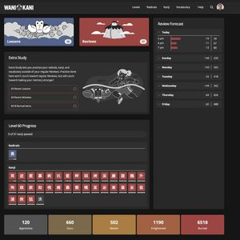

# WaniKani Elementary Dark

A dark-themed css stylesheet and styling platform for the wanikani.com domain.

This stylesheet overrides the default WaniKani styling with a consistent set of
dark colors.

Elementary Dark also makes it easy for users to specify their own
desired colors.

Finally, Elementary Dark also makes it easy for script writers
to specify their desired default colors as well as pick up a user's desired colors
if they have the Elementary Dark theme loaded.

This theme was heavily influenced by [OpenProps](https://open-props.style/) and
leverages CSS custom properties (AKA "CSS variables") throughout.

Please use the [Wanikani Community
Forum](https://community.wanikani.com/t/userstyle-wanikani-elementary-dark/60137)
to request any changes or additions to these stylesheets.

## Default appearance



- Dashboard view: [avif](./pics/dashboard.avif) [jpeg](./pics/dashboard.jpg)
- Individual kanji page: [avif](./pics/kanji.avif) [jpeg](./pics/kanji.jpg)
- Review screen: [avif](./pics/review.avif) [jpeg](./pics/review.jpg)

## Installation

1. First, install a userstyle manager in your browser.

   We recommend [stylus](https://github.com/openstyles/stylus). It is available on
   the [Chrome Web Store](https://chrome.google.com/webstore/detail/stylus/clngdbkpkpeebahjckkjfobafhncgmne)
   as well as a [Firefox add-on](https://addons.mozilla.org/firefox/addon/styl-us/).

2. Next, install the WaniKani Elementary Dark stylesheet itself:

   - This [install link](https://userstyles.world/api/style/8103.user.css) will
     install it in Stylus directly.

   - The script is hosted on [userstyles.world](https://userstyles.world/style/8103/wanikani-elementary-dark).

   - The [source repository](https://github.com/Sepitus-exe/WKElementaryDark) is
     hosted on GitHub.

3. [Optional] Install any additional stylesheets desired for [Wanikani user
   scripts](#styling-user-scripts).

4. [Optional] See the section on [defining custom colors](#defining-custom-colors) if
   you'd like to override the default colors.

## Styling user scripts

In general, we would prefer that individual script writers update their
own scripts to support theming in general (if not Elementary Dark in
particular).

With very few exceptions, the Elementary Dark stylesheet itself only styles the
official Wanikani pages. It makes no changes to sections that user scripts
may have added or modified.

We have, however, created [additional stylesheets](./userscript-styles/) for
popular scripts that don't support theming. Feel free to contact the authors if
you'd like to request any others.

Currently, the following scripts are supported (click the installation links to
install in stylus):

- Self-study Quiz: [installation link](#) [source code](./userscript-styles/WKED-self-study.css)
- Stroke Order Diagram: [installation link](#) [source code](./userscript-styles/WKED-stroke-order.css)
- Ultimate timeline: [installation link](#) [source code](./userscript-styles/WKED-ultimate-timeline.css)

## Defining custom colors

Every color in Wanikani Elementary Dark can be customized!

If you'd prefer a different color scheme:

1. Make a copy of the [All-variables stylesheet](./user-overrides/All-variables.css).

2. Uncomment and edit any of the custom properties you wish to change. You only
   need to specify the properties you wish to change.

3. Save your file in the stylus editor:

   1. Click "manage" under the stylus plugin dialog in your browser.
   2. Unclick the "as Usercss" checkbox, then click the "Write new Style"
      button.
   3. Copy and paste the contents of your override stylesheet into the editor.
   4. Give your stylesheet a name (in the upper left of your screen).
   5. Click the "Save" button.

## Notes on colors

Choose your surface and text colors wisely.

- Surface-1 is intended to represent containers/surfaces that are lowest in
  the stacking order (farthest from the user). Higher numbered surfaces
  stack on top of each other, with surface-4 closest to the user. The inverted
  surface can be considered closest of all.

- The custom property names assume a dark color theme. In particular, the
  text-clr color is used over everything _except_ inverted-surface which uses
  text-inverted-text.

It's a good idea to create your own palette of colors using your own custom
properties, then re-define the `--USER-*` properties using your own custom
props. See [Rex's user override](./user-overrides/rexs-overrides.css) for an
example.

Using HSL rather than RGB/hex values can be handy when defining colors. It's
easy to create tints and shades of the same hue with HSL.

## Semantic naming

All of the user-overridable properties use a _semantic_ naming convention. The
authors have attempted to group related things. This makes it easier to know
what will be affected if you override a setting: it would be difficult to know
what, say, "--reddish-brown-32" might be used to represent, but hopefully
"--USER-kanji-clr" is easier to guess.

### Surfaces

The variables `--USER-surface-1` to `--USER-surface-4` represent four
overlapping "layers" of boxes/containers in the UI. Surface-1 is the farthest
from the user, surface-2 stacks "on top" of that, and so on.

The topmost compositional layer is `--USER-inverted-surface` and is closest to
the user. Unlike the other surfaces, this color is expected to be so light that
it needs dark colored text to remain legible. Everything else uses `text-clr`.

### Text

There are four text colors you can override:

- `--USER-text-clr` is the default color used over everything except
  `inverted-surface`. Please ensure text remains legible over all your color
  choices with this foreground text color.

- `--USER-inverted-text` is the inverted foreground color used over
  `inverted-surface`.

- `--USER-highlighted-text` specifies the color to use for emphasized text.

- `--USER-grayed-text` specifies the color to use for de-emphasized text.

### Branding

These specify the "chrome" or branding color for things that can have an arbitrary
color that doesn't imply a particular meaning (unlike kanji/vocabulary or
apprentice/guru/etc., for example, where the color has a meaning).

`--USER-brand` is the primary brand color. You might consider setting this to
the same color as your kanji color, or your enlightened/burned colors.

### Meaning/reading

These are used to color the headings during lessons and reviews to indicate
whether the current quiz is asking about a _meaning_ or a _reading_.

### Item type

The radical/kanji/vocabulary/extra colors indicate the _type_ of an item. This
provides most of the styling for the site, so choose your colors wisely.

### SRS stages

The "buckets" for SRS stages also get their own colors: apprentice, guru,
master, enlightened, and burned. In general, you'll want some sort of clear
progression in your color choices here. The idea is to show progress toward
burning an item.

### Review/lesson

As you'd expect, these colors indicate whether a UI element is for reviewing
something you've already "learned," or if it's for "lessons" to learn something
new.

### Misc

Finally, we have colors for correct and incorrect responses, alerts, and
"success" indications. These are used as you'd expect.

The only other variable is the progress color, which is used to color progress
bars throughout. You may want to re-use your branding color to indicate progress.

## Notes for user script writers

We would like to encourage WaniKani user script writers to use these same naming
conventions in their own CSS rules.

The `--ED-*` variables in the main stylesheet are the external API. We will try
not to make any breaking changes or delete any of these (though additions
shouldn't break anything pre-existing).

Please use the `--ED-*` variables in your own CSS, and, in particular, do NOT use
`--USER-*` properties directly in your css files. Using the similarly named
`--ED-*` variables ensures that users only need to define the specific colors
they want to override rather than always having to include everything.

You can safely use any `--ED-*` property directly if WKElementaryDark is loaded,
but your CSS rules should use the custom property fallback/default
facility in case the main stylesheet isn't loaded for some unfathomable reason.

As an example, imagine your script has an outermost element with
an id of "#my-awesome-script" and a container div with the CSS class "container".
Suppose further that you wanted a dark olive green background, white text, and
white border unless Elementary Dark is loaded.

Your css rule might look like:

```css
#my-awesome-script .container {
  background-color: var(--ED-surface-2, darkolivegreen);
  color: var(--ED-text-color, #ffff);
  border: 1px solid var(--ED-surface-5, #ffffff);
}
```

Your container div will look

## Authors

- @Sepitus-exe Original author, lead designer, primary developer

- @wrex Contributor, responsible for most bugs
